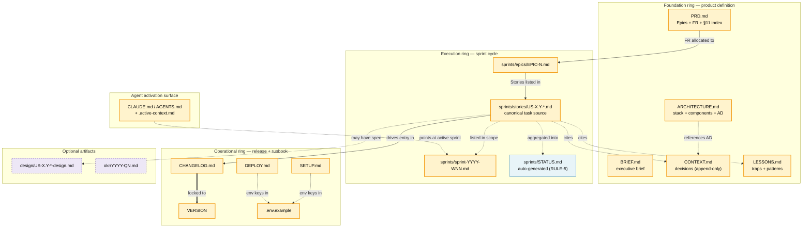
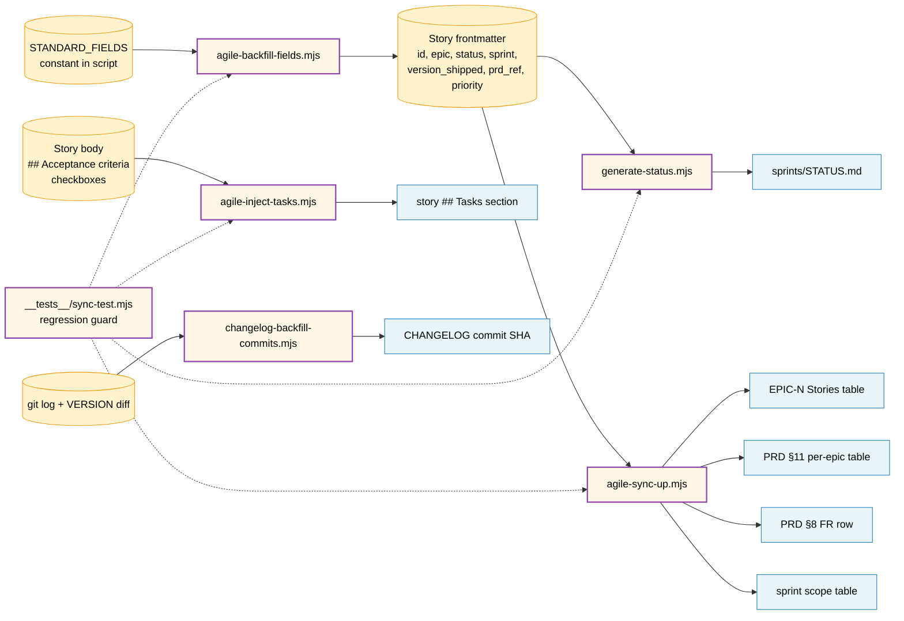
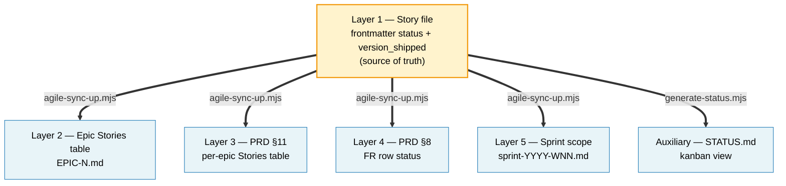

# ARCHITECTURE — Koni-Skills

> Last updated: 2026-05-27 (v0.1.0)
> Maintainer: @AnhMTV

## System overview

Koni-Skills is a **GitHub-hosted skill catalog** — a flat collection of
self-contained skill directories under `skills/<name>/`, distributed via
the `npx skills` CLI. There is no server, no runtime, and no build step
for the catalog itself; each skill is content-addressed by a hash
recorded in `skills-lock.json`. The repo also dogfoods its own
`koni-docs` skill: this repo's `docs/` folder is structured and managed
by exactly the rules and templates the skill publishes.

Architectural drivers: (a) **agent-agnostic loading** — every major
coding agent (Claude Code, Codex, Cursor, Gemini, Copilot) must
activate the same skill the same way; (b) **token-efficient activation**
— skill body ≤ 500 lines, on-demand template loading; (c) **zero
divergence across consumer repos** — one upgrade command, lockfile-tracked.

## Tech stack

| Layer | Technology | Version | Rationale |
|-------|-----------|---------|-----------|
| Runtime | Node.js | ≥ 20 LTS | Required by `npx skills` CLI and bundled `*.mjs` scripts |
| Distribution CLI | `npx skills` | latest | Lockfile-tracked install/update/remove; GitHub as source-of-truth |
| Skill spec | `SKILL.md` (YAML frontmatter + Markdown body) | — | Format agreed across `anthropics/skills`, gstack skills, and Koni-Skills |
| Automation | Node ES modules (`*.mjs`) | — | Zero-dependency scripts; same runtime as the CLI |
| Test runner | Plain Node + custom assertions | — | Self-contained — no Jest/Vitest dependency for sync-test |
| Hosting | GitHub (public repo) | — | `npx skills` reads `github.com/<org>/<repo>` directly |
| Versioning | Semantic versioning, file: `VERSION` | — | Bumped in lockstep with CHANGELOG (RULE-1) |

## Component architecture

```
┌────────────────────────────────────────────────────────────────────┐
│                       Koni-Skills repository                       │
│                                                                    │
│  ┌──────────────────┐    ┌─────────────────────────────────────┐   │
│  │   skills/<name>/ │    │  .agents/skills/<installed-helper>/ │   │
│  │  ┌────────────┐  │    │  (e.g. skill-creator)               │   │
│  │  │ SKILL.md   │  │    │  managed by `npx skills`            │   │
│  │  │ references/│  │    └─────────────────────────────────────┘   │
│  │  │ scripts/   │  │                                              │
│  │  │ assets/    │  │    ┌─────────────────────────────────────┐   │
│  │  └────────────┘  │    │  skills-lock.json                   │   │
│  └──────────────────┘    │  hash + source per installed skill  │   │
│         ▲                └─────────────────────────────────────┘   │
│         │ dogfood                                                  │
│  ┌──────┴──────────────────────────────────────────────────────┐   │
│  │                          docs/                              │   │
│  │  Brief / PRD / Arch / Context / Lessons / Sprints / STATUS  │   │
│  │  managed by the very `skills/koni-docs/` skill above        │   │
│  └─────────────────────────────────────────────────────────────┘   │
└────────────────────────────────────────────────────────────────────┘
                              │
                              │ `npx skills add Koniverse/Koni-Skills --skill <name>`
                              ▼
                  ┌─────────────────────────────┐
                  │  Consumer Koniverse project │
                  │  reads SKILL.md at agent    │
                  │  session-start              │
                  └─────────────────────────────┘
```

| Component | Responsibility | Tech | Key files |
|-----------|---------------|------|-----------|
| Skill source | Per-skill instructions + bundled resources | Markdown + YAML + `.mjs` | `skills/<name>/` |
| Helper skills | Third-party skills (e.g. `skill-creator`) used during development | Markdown + Python/JS | `.agents/skills/<name>/` |
| Lockfile | Records installed skills, sources, content hashes | JSON | `skills-lock.json` |
| Dogfood docs | This repo's own canonical documentation | Markdown + YAML | `docs/` |
| Agent guides | Entry points for AI agents | Markdown | `CLAUDE.md`, `AGENTS.md` |

## Skill anatomy

Every skill in `skills/<name>/` follows the same shape:

```
skills/<name>/
├── SKILL.md            ← required: YAML frontmatter + body, ≤ 500 lines
├── references/         ← optional: loaded on demand
│   ├── rules.md
│   ├── templates.md
│   └── templates/      ← one file per document type
├── scripts/            ← optional: bundled automation, executed directly
│   ├── *.mjs
│   └── __tests__/      ← regression tests
└── assets/             ← optional: files referenced from output
```

**Activation contract** (consumed by every coding agent):
1. Agent reads project's `CLAUDE.md` / `AGENTS.md` at session start.
2. Agent encounters a Koni-Docs Integration block referencing
   `skills/<name>/SKILL.md`.
3. On a matching user request, agent loads `SKILL.md` body, then loads
   the specific reference file from the activation table on demand.
4. Agent never loads bundled scripts as text — it executes them via
   `node skills/<name>/scripts/<file>.mjs`.

## Data architecture

### Lockfile schema (`skills-lock.json`)

```json
{
  "version": 1,
  "skills": {
    "<skill-name>": {
      "source": "<org>/<repo>",
      "sourceType": "github",
      "skillPath": "skills/<name>/SKILL.md",
      "computedHash": "<sha256 hex>"
    }
  }
}
```

| Field | Purpose | Indexes |
|-------|---------|---------|
| `source` | GitHub `org/repo` the skill was installed from | — |
| `sourceType` | Currently always `github`; reserved for future sources | — |
| `skillPath` | Path within the source repo to the skill's `SKILL.md` | — |
| `computedHash` | SHA-256 of the resolved SKILL.md content at install time | Drift detection on `npx skills update` |

### Doc layer schema (5-layer consistency)

The `koni-docs` 5-layer consistency contract: every story status change
must propagate through these layers. Implemented by
[`agile-sync-up.mjs`](../skills/koni-docs/scripts/agile-sync-up.mjs).

| Layer | File | Schema element |
|-------|------|----------------|
| 1 — Story | `docs/sprints/stories/US-X.Y-*.md` | `status`, `version_shipped`, AC + Tasks `[x]` |
| 2 — Epic | `docs/sprints/epics/EPIC-N.md` | Stories table row matching the story id |
| 3 — PRD §11 | `docs/PRD.md` | Per-epic Stories table row |
| 4 — PRD §8 | `docs/PRD.md` | FR row referencing the story |
| 5 — Sprint | `docs/sprints/sprint-YYYY-WNN.md` | Sprint scope row |

A sixth artifact, `docs/sprints/STATUS.md`, is auto-generated by
[`generate-status.mjs`](../skills/koni-docs/scripts/generate-status.mjs)
— never hand-edited (RULE-5).

## Koni-docs framework model

The `koni-docs` skill manages **three concentric rings** of artifacts in a
consumer repo's `docs/` tree: a *foundation* ring (product definition that
rarely changes), an *execution* ring (sprint-cycle artifacts that turn
over every week or two), and an *operational* ring (release + runbook
artifacts that change per commit). A small set of `*.mjs` scripts under
[`skills/koni-docs/scripts/`](../skills/koni-docs/scripts/) keep the
rings consistent. Every script is **one-way**: it reads a canonical
source and projects derived facts into other files — never the reverse.

### Doc artifact map



Legend: **yellow** = source of truth (hand-authored or append-only),
**blue** = derived artifact (regenerated from sources, never hand-edited),
**purple dashed** = optional artifact (present only if the project opts in).

### Managed object inventory

Before any script-standardization work (T1 hardening, see [Open
architecture questions](#open-architecture-questions)), this is the full
set of objects a structured-content tool must understand. The model has
**three layers**:

- **L1 — File-level entities** — each `.md` (or bare-value) file is one
  entity; cardinality is 1 (singleton) or N (per id).
- **L2 — Embedded sub-objects** — structured items that live *inside* an
  L1 file. Each has a stable identifier and an authoring rule.
- **L3 — Cross-document IDs** — the reference graph that holds the
  5-layer consistency contract together.

Anything not in these tables is free-form prose and scripts should not
try to parse it.

#### L1 — File-level entities

| Entity | File pattern | Cardinality | Ring | Source role |
|---|---|---|---|---|
| Story | `docs/sprints/stories/US-X.Y-*.md` | N | Execution | SoT for everything; canonical task source |
| Epic | `docs/sprints/epics/EPIC-N.md` | N | Execution | SoT for cross-cutting invariants + pillar mapping; tables derived |
| Sprint | `docs/sprints/sprint-YYYY-WNN.md` | N (active + archive) | Execution | SoT for goal + retro; scope-table status derived |
| Status (kanban) | `docs/sprints/STATUS.md` | 1 | Execution | Fully derived (RULE-5) |
| PRD | `docs/PRD.md` | 1 | Foundation | SoT for §1–§7; FR/NFR/§11 mix author + derived status |
| Brief | `docs/BRIEF.md` | 1 | Foundation | SoT (prose) |
| Architecture | `docs/ARCHITECTURE.md` | 1 | Foundation | SoT (prose + AD table) |
| Context | `docs/CONTEXT.md` | 1 | Foundation | SoT (append-only, RULE-7) |
| Lessons | `docs/LESSONS.md` | 1 | Foundation | SoT (append-only) |
| Changelog | `docs/CHANGELOG.md` | 1 | Operational | SoT entries; commit SHA derived (RULE-2) |
| Version | `VERSION` | 1 | Operational | SoT (bare semver string) |
| Setup | `docs/SETUP.md` | 1 | Operational | SoT (env triplet, RULE-11) |
| Deploy | `DEPLOY.md` (repo root) | 1 | Operational | SoT (env triplet, RULE-11) |
| Env example | `.env.example` (repo root) | 1 | Operational | SoT (env triplet, RULE-11) |
| Design spec | `docs/design/US-X.Y-*-design.md` | N (optional, per story) | Optional | SoT |
| OKR ledger | `docs/okr/YYYY-QN.md` | N (optional, per quarter) | Optional | SoT |
| Active context | `.active-context.md` (gitignored) | 1 | Activation | SoT for per-dev block; auto-block derived (T1–T7) |
| Agent integration block | `CLAUDE.md`, `AGENTS.md` | 1 each | Activation | SoT (config) + pointer to active context |

#### L2 — Embedded sub-objects

Grouped by parent file. The "Identified by" column is what a script
must match on; the "Authoring" column says who/what writes it.

| Sub-object | Parent | Identified by | Authoring |
|---|---|---|---|
| Frontmatter field | story / epic / sprint / OKR / design | YAML key name | hand-edit; `agile-backfill-fields` adds missing keys |
| AC item | story `## Acceptance criteria` | `AC-N` (immutable, no renumber) | hand-edit checkbox state (RULE-10) |
| Task item | story `## Tasks` | `TASK-X.Y.N` | derived from AC by `agile-inject-tasks` |
| Verification command | story `## Verification commands` | bound to `AC-N` | hand-edit |
| Architecture-constraint bullet | story dev notes | bound to `AD-N` | hand-edit |
| Cross-story dependency bullet | story dev notes | story ID + artifact name | hand-edit |
| Performance-budget bullet | story dev notes | concern name + p95 number | hand-edit |
| Files-modified entry | story `## Files modified` | file path | hand-edit during impl |
| Changelog draft section | story `## Changelog entry` | `### Added/Changed/Fixed/...` | hand-edit; copied verbatim into CHANGELOG at ship |
| Stories-table row | epic `## Stories` | story ID in first data cell | DERIVED status + version by `agile-sync-up` |
| FR-Coverage row | epic `## FR Coverage` | FR ID | hand-edit + DERIVED status |
| AD-Coverage row | epic `## AD Coverage` | AD ID | hand-edit |
| Feature-pillar row | epic `## Feature pillars` | pillar number | hand-edit |
| Object-map diagram | epic | mermaid block | hand-edit |
| US ↔ entity matrix row | epic | story ID | hand-edit |
| Cross-cutting invariant bullet | epic | invariant statement + FR/AD ref | hand-edit |
| RBAC-additions row | epic | (resource, action) tuple | hand-edit |
| Cross-story testing row | epic | pattern name | hand-edit |
| Performance-budgets row | epic | concern name | hand-edit |
| Propagated-AC checklist row | epic | one-line AC summary | hand-edit checkbox |
| Sprint-scope row | sprint | story ID in first data cell | hand-edit row + DERIVED status by `agile-sync-up` |
| Phased-plan step | sprint | phase number | hand-edit |
| Per-epic retro row | sprint | epic ID | hand-edit |
| Retrospective bullet | sprint `## Retrospective` | sub-section (Went-well / Didn't / Followups) | hand-edit on sprint close |
| FR row | PRD §8 | `FR-N` | hand-edit + DERIVED status by `agile-sync-up` |
| NFR row | PRD §9 | `NFR-N` | hand-edit |
| Success-criterion row | PRD §2 | success ID | hand-edit |
| Persona entry | PRD §5 | persona name | hand-edit |
| Per-epic Stories table | PRD §11 | epic ID header + story ID rows | DERIVED status + version by `agile-sync-up` |
| AD row | PRD / ARCHITECTURE.md `## Architecture decisions` | `AD-N` | hand-edit (append-only spirit) |
| Changelog entry | CHANGELOG.md | `[X.Y.Z]` header | hand-edit; commit SHA derived by `changelog-backfill-commits` |
| Decision entry | CONTEXT.md | `D<N>` (immutable; revisions via `D<N+1> (revision of D<M>)`) | hand-append (RULE-7) |
| Revision entry | CONTEXT.md | `D<N> (revision of D<M>)` | hand-append (RULE-7) |
| Lesson entry | LESSONS.md | `§N` | hand-append |
| OKR objective | OKR ledger | `O<N>` | hand-edit |
| OKR key result | OKR ledger | `KR<N>.<M>` | hand-edit |
| OKR weekly note | OKR ledger | ISO week number | hand-append |
| Env-var triplet | SETUP.md + DEPLOY.md + .env.example | env key name | hand-edit in lockstep (RULE-11) |
| Design-spec screen | design/*-design.md | screen name | hand-edit |
| Active-context line | `.active-context.md` auto-block | line type (Sprint / Active Stories / Last Version / Recent Decisions / Recent Lessons) | DERIVED on triggers T1–T7 |

#### L3 — Cross-document ID graph

The 5-layer consistency contract is held together by these ID spaces.
Every script that touches docs is, at heart, a graph-walking operation
over these references.

| ID space | Format | Issued in | Referenced by |
|---|---|---|---|
| Story ID | `US-X.Y` | story filename + frontmatter `id` | epic Stories table, PRD §11, sprint scope, STATUS, design spec name, story Background, lesson cross-refs |
| Epic ID | `EPIC-N` | epic filename + frontmatter `id` | story frontmatter `epic`, PRD §8 FR row "Epic" cell, sprint scope row, retro table |
| Sprint ID | `sprint-YYYY-WNN` | sprint filename + frontmatter `id` | story frontmatter `sprint`, active context, archive folder name |
| FR ID | `FR-N` | PRD §8 | story frontmatter `prd_ref`, epic FR Coverage, epic invariants |
| NFR ID | `NFR-N` | PRD §9 | architecture sections, design specs |
| AD ID | `AD-N` | ARCHITECTURE.md `## Architecture decisions` + PRD | story dev notes, epic AD Coverage, CONTEXT decision rationale |
| Decision ID | `D<N>` | CONTEXT.md | story Background, ARCHITECTURE.md AD table, active context "Recent Decisions" |
| Lesson ID | `§N` | LESSONS.md | story Background, active context "Recent Lessons" |
| Version | `X.Y.Z` semver | VERSION file + CHANGELOG header | story `version_shipped`, epic Stories table, PRD §11, PRD §8 FR row, active context "Last Version" |
| Commit SHA | git 7-char or full | git history | story frontmatter `commit`, CHANGELOG entry `**Commit**` |
| Env var key | `UPPER_SNAKE_CASE` | env block | SETUP.md, DEPLOY.md, .env.example (all 3 by RULE-11) |
| Pillar number | small integer | epic `## Feature pillars` | epic-internal only (no cross-doc reference) |
| Phase number | small integer | sprint `## Phased plan` | sprint-internal only |

> The hardening work (T1) needs to cover L1 frontmatter parsing
> (replace hand-rolled parser with `gray-matter`), L2 table-row /
> checkbox-list manipulation (use `unified`+`remark` with column-name
> resolution), and L3 ID-graph validation (cross-file integrity:
> story.epic must exist, story.prd_ref must resolve to an FR row,
> etc.). Items in L2 marked "hand-edit" only require parsing for
> validation — not editing — so they can ride on the same parser
> without expanding script scope.

### Script roles

Each script reads from a clearly-named source and writes into one or more
derived locations. Sources are tagged yellow; sinks are tagged blue.



`agile-backfill-fields.mjs` is the only script that writes back to its
own input — it adds missing keys to story frontmatter using the
in-script `STANDARD_FIELDS` constant as the schema.

### Status propagation — 5-layer consistency contract

A single field change in story frontmatter (`status: in-progress → done`,
or setting `version_shipped: v0.3.0`) must reach five derived locations.
`agile-sync-up.mjs` is the projector; `generate-status.mjs` adds a sixth,
kanban-shaped projection.



| Layer | File | Cell updated | Matched by |
|-------|------|--------------|-----------|
| 1 | `docs/sprints/stories/US-X.Y-*.md` | source — frontmatter | — |
| 2 | `docs/sprints/epics/EPIC-N.md` | last two cells of Stories row (status, version) | story `id` in first data cell |
| 3 | `docs/PRD.md` §11 | last two cells of per-epic Stories row | story `id` in first data cell |
| 4 | `docs/PRD.md` §8 | status cell of FR row | story `prd_ref` matches FR ID |
| 5 | `docs/sprints/sprint-YYYY-WNN.md` | second-to-last data cell (status) | story `id` in first data cell + story `sprint` matches sprint ID |
| 6 | `docs/sprints/STATUS.md` | full file regenerated | every file in `stories/` with a parseable `id` |

> **Known fragility**: layers 2 and 5 address cells by **position**, not by
> column name. Inserting a new column shifts the target cell silently — see
> the schema-aware projector item under
> [Open architecture questions](#open-architecture-questions).

## API architecture

> Koni-Skills exposes no HTTP API. The "API" the catalog has is the
> `npx skills` CLI surface — install, update, remove, list. That CLI's
> contract is owned upstream (it is not part of this repo). The table
> below names the CLI invocations the catalog supports.

| Invocation | Effect |
|------------|--------|
| `npx skills add <org>/<repo> --skill <name>` | Resolve skill, install into `.agents/skills/<name>/`, record in lockfile |
| `npx skills add <org>/<repo> --list` | Browse skills available in a source repo without installing |
| `npx skills experimental_install` | Restore every skill declared in `skills-lock.json` (used on fresh clone) |
| `npx skills update [<name>]` | Refresh installed skill(s); update lockfile hash |
| `npx skills remove --skill <name>` | Remove an installed skill |
| `npx skills list [--json]` | List installed skills (human or machine-readable) |
| `npx skills init koni-<name>` | Scaffold `skills/<name>/SKILL.md` for a new skill |

## Security architecture

| Concern | Approach | Detail |
|---------|----------|--------|
| Source authenticity | GitHub repo URL | `npx skills add` resolves against a specific `org/repo` — no third-party registry hop |
| Content integrity | SHA-256 lockfile hash | Stored in `skills-lock.json`; recomputed on update; mismatch surfaces as drift |
| Skill code execution | Skills are read by the agent; bundled scripts run only when agent invokes `node ...` | No auto-exec; agents must explicitly call scripts |
| Secrets in skills | Forbidden — skills are public artifacts | No `.env` files inside `skills/<name>/`; reviewers reject |
| Doc rule enforcement | `koni-docs` rules (RULE-1..14) | Pre-commit checklist + grep-style verification in `references/rules.md` |

## Deployment architecture

This repo is **not deployed**. It is consumed by:

```
Koniverse/Koni-Skills (this repo, GitHub)
  │
  │ `npx skills add Koniverse/Koni-Skills --skill koni-docs`
  ▼
Consumer project (any Koniverse repo)
  └── .agents/skills/koni-docs/   ← installed copy
      skills-lock.json            ← hash + source recorded
```

The "release" of a new skill version is:
1. Bump `VERSION` in this repo.
2. Add a `docs/CHANGELOG.md` entry with the real commit SHA.
3. `git tag v<X.Y.Z>` and push.
4. Consumer projects run `npx skills update` on their next sprint.

## Integration architecture

| External tool | Purpose | Activation | Fallback |
|---------------|---------|------------|----------|
| BMad | Upstream brainstorm → brief → PRD → epics/stories pipeline | Manual map: BMad artifacts → koni-docs templates | Templates work standalone if BMad is not used |
| GStack | Plan / design / QA review skills | Optional; koni-docs is independent | Pre-commit checklist works without GStack |
| Superpowers | Implementation skills (TDD, dispatching, etc.) | Optional; complements koni-docs | Plain implementation works without |
| `skill-creator` (anthropics/skills) | Develop / evaluate / package skills in this repo | Installed via `npx skills` in this repo only | Skills can be developed by hand |
| `npx skills` CLI | Distribution + lockfile | Required for consumers | — |

## Architecture decisions

| ID  | Topic | Summary | Version | CONTEXT Ref |
|-----|-------|---------|---------|-------------|
| AD-1 | Skill = self-contained directory | Each skill ships SKILL.md + references + scripts in one path; no cross-skill imports | v0.1.0 | [D1](CONTEXT.md) |
| AD-2 | Distribution via `npx skills` + lockfile | Content-hashed install/update; GitHub is the source-of-truth | v0.1.0 | [D2](CONTEXT.md) |
| AD-3 | 9 project-agnostic rules + plugin slot | Core rules stay sharp; stack rules ship as separate plugin skills | v0.1.0 | [D3](CONTEXT.md) |
| AD-4 | Templates split one-file-per-type | Agents load only the template matching a user request — token efficiency | v0.1.0 | [D4](CONTEXT.md) |
| AD-5 | Pipeline integration as standardizer (not replacement) | Koni-docs maps BMad/GStack/Superpowers output to canonical docs; doesn't replace them | v0.1.0 | [D5](CONTEXT.md) |
| AD-6 | Dogfood `koni-docs` on this repo itself | If we can't run the skill on its own home, consumers will hit the same gaps | v0.2.0 (planned) | [D6](CONTEXT.md) |

Individual decisions are recorded in [CONTEXT.md](CONTEXT.md). Link new
architecture decisions from CONTEXT.md here as they are recorded.

## Open architecture questions

- [ ] How should plugin skills (`koni-supabase`, `koni-nextjs`) declare
      they *extend* `koni-docs` rules without copy-pasting them?
      Candidate: a `koni-docs-plugins:` array in the integration block
      that the agent reads as a load directive.
- [ ] Should sync scripts also be exposed via `npx skills exec
      koni-docs:sync-up`? Currently the canonical invocation is `node
      skills/koni-docs/scripts/agile-sync-up.mjs` — works, but is verbose.
- [ ] What is the right CI gate? Today the regression test runs locally;
      a GitHub Action would catch drift on PRs.
- [ ] Should `agile-sync-up.mjs` become **schema-aware** — read column
      names from the destination file's frontmatter (or from the table's
      header row) and address cells by name instead of by position? This
      would survive non-template column additions (e.g. the `Carry`
      column added to the W23 sprint scope table) without silent
      mis-writes.
