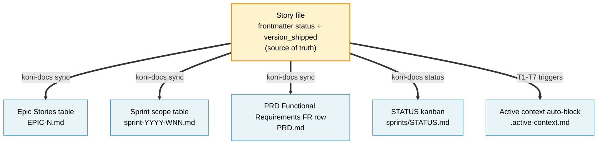

# ARCHITECTURE — Koni-Skills

> Last updated: 2026-05-28 (v0.7.1)
> Maintainer: @AnhMTV

## System overview

Koni-Skills is a **dual-distribution documentation framework**. Two
complementary surfaces ship from the same repo:

1. A **GitHub-hosted skill catalog** under `skills/<name>/` — flat,
   content-addressed via `skills-lock.json`, distributed by the
   upstream `npx skills` CLI. This is how AI coding agents pick up the
   doc rules + activation templates.
2. A **published npm package**, `@koniverse/koni-docs` (in
   [`packages/koni-docs/`](../packages/koni-docs/)), that provides the
   typed CLI binary (`npx koni-docs ...`), a programmatic TypeScript
   library, and an Astro-based doc viewer. This is how human operators
   and CI actually perform doc mutations.

The repo dogfoods itself: this repo's own `docs/` tree is produced by
exactly the rules its `koni-docs` skill publishes and operated on by
exactly the CLI its `@koniverse/koni-docs` package exposes.

Architectural drivers:

- **Agent-agnostic loading** — every major coding agent (Claude Code,
  Codex, Cursor, Gemini, Copilot) activates the same skill the same way
  via `SKILL.md` + `references/`.
- **Typed library reuse** — programmatic doc operations live in
  `@koniverse/koni-docs/lib`, importable by any TypeScript consumer.
  Mutations are unit-tested with `node:test`; the skill itself ships no
  executable code.
- **Schema-aware mutations** — table cell updates address columns by
  **name** (not position), so adding a column (e.g. `Carry` to a sprint
  scope table) does not silently corrupt sync. Closes the legacy
  position-based fragility.
- **AST-based markdown** — `unified` + `remark-gfm` parse docs into
  mdast; every edit goes through `parseTable` / `findSection` /
  `parseCheckboxes`. No string regex splices against doc bodies.
- **Zero divergence across consumer repos** — one upgrade
  (`npm i @koniverse/koni-docs@latest` and/or `npx skills update`),
  lockfile-tracked on both channels.

## Tech stack

| Layer | Technology | Version | Rationale |
|-------|-----------|---------|-----------|
| Runtime | Node.js | ≥ 20 LTS | Required by both `npx skills` and `@koniverse/koni-docs` CLI |
| Language | TypeScript | 5.9 | Single source for CLI, lib, and viewer |
| Bundler | tsup | ^8 | Builds CLI + lib into ESM `dist/`; zero bundler config |
| Test runner | Node built-in (`node:test`) + tsx loader | — | `npm test` = `node --import tsx --test`; no Jest/Vitest |
| CLI framework | commander | ^11 | Per-subcommand registration in `src/cli/*.ts` |
| Frontmatter parser | gray-matter (+ js-yaml) | ^4 | YAML frontmatter read/write with quote-style preservation |
| Markdown AST | unified + remark-parse + remark-stringify + remark-gfm + mdast-util-to-string | ^11 / ^4 | GFM-aware mdast manipulation (tables, checkboxes, sections) |
| Schema validation | Zod | ^3 | Story / Epic / Sprint / Changelog-entry runtime types |
| Viewer | Astro SSR (Node adapter) + Tailwind v4 + Shiki | ^4.16 / v4 / ^1 | Live doc browser with Shiki-highlighted code |
| File watcher | chokidar | ^3 | Fans `*.md` writes into the viewer's SSE reload bus |
| Distribution (skill) | `npx skills` (upstream) | latest | Resolves `Koniverse/Koni-Skills`; hashes `SKILL.md` into `skills-lock.json` |
| Distribution (CLI) | npm registry, scoped package | — | `@koniverse/koni-docs` consumed via `npm i` or `npx` |
| Skill spec | `SKILL.md` (YAML frontmatter + Markdown body) | — | Standard across `anthropics/skills`, gstack, Koni-Skills |
| Versioning | Repo-wide semver, `VERSION` (root) + `packages/koni-docs/package.json` | — | Lockstep bump on release |
| Hosting | GitHub (public repo) + npm registry | — | Skill on GitHub; CLI bin on npm |

## Component architecture

```
┌───────────────────────────────────────────────────────────────────────────────┐
│                         Koni-Skills repository                                │
│                                                                               │
│  ┌──────────────────────┐    ┌─────────────────────────────────────────────┐  │
│  │ skills/koni-docs/    │    │ packages/koni-docs/  (@koniverse/koni-docs) │  │
│  │  ┌────────────────┐  │    │  ┌───────────────────────────────────────┐  │  │
│  │  │ SKILL.md       │  │    │  │ src/cli/   — commander subcommands    │  │  │
│  │  │   (rules,      │  │    │  │   sync, status, validate,             │  │  │
│  │  │    templates   │  │    │  │   inject-tasks, backfill-fields,      │  │  │
│  │  │    pointer)    │  │    │  │   backfill-commits, preview           │  │  │
│  │  │ references/    │  │    │  └───────────────────────────────────────┘  │  │
│  │  │   rules.md     │  │    │  ┌───────────────────────────────────────┐  │  │
│  │  │   sprint-      │  │    │  │ src/lib/   — typed library            │  │  │
│  │  │   system.md    │  │    │  │   doc · corpus · refs · markdown      │  │  │
│  │  │   templates/   │  │    │  │   · schemas · changelog · git         │  │  │
│  │  └────────────────┘  │    │  └───────────────────────────────────────┘  │  │
│  │  (NO scripts/        │    │  ┌───────────────────────────────────────┐  │  │
│  │   anymore — moved    │    │  │ src/viewer/ — Astro SSR docs UI       │  │  │
│  │   to npm package)    │    │  │   /project · /docs/[...slug] ·        │  │  │
│  │                      │    │  │   /koni-docs-rt/reload (SSE)          │  │  │
│  └──────────────────────┘    │  └───────────────────────────────────────┘  │  │
│            │                  └─────────────────────────────────────────────┘  │
│            │ activated by                          │                           │
│            ▼                                       │ built by tsup, published  │
│   AI agent at session start                        │ as @koniverse/koni-docs   │
│   (Claude / Codex / Cursor)                        ▼                           │
│                                              npm registry                      │
│                                                                                │
│  ┌────────────────────────────────────────────────────────────────────────┐    │
│  │ docs/   (this repo dogfoods koni-docs — operated by the npm package)   │    │
│  │ BRIEF / PRD / ARCH / CONTEXT / LESSONS / CHANGELOG / sprints/ / ...    │    │
│  └────────────────────────────────────────────────────────────────────────┘    │
└───────────────────────────────────────────────────────────────────────────────┘
                          │                                  │
                          │ `npx skills add ...`             │ `npm i @koniverse/koni-docs`
                          ▼                                  ▼
              Consumer Koniverse project:           Operator/CI in same project
              SKILL.md loaded at agent              runs `npx koni-docs sync`
              session-start                          against its own docs/
```

| Component | Responsibility | Tech | Key files |
|-----------|---------------|------|-----------|
| Skill source | Per-skill activation rules + templates, loaded by AI agents | Markdown + YAML | [`skills/koni-docs/SKILL.md`](../skills/koni-docs/SKILL.md), [`skills/koni-docs/references/`](../skills/koni-docs/references/) |
| CLI binary | Subcommand entrypoints for operators + CI | TypeScript + commander | [`packages/koni-docs/src/cli/`](../packages/koni-docs/src/cli/) |
| Library | Programmatic doc I/O + markdown AST + schemas + ref-graph | TypeScript | [`packages/koni-docs/src/lib/`](../packages/koni-docs/src/lib/) |
| Viewer | Live, SSR-rendered docs browser with SSE hot reload | Astro + Tailwind + Shiki | [`packages/koni-docs/src/viewer/`](../packages/koni-docs/src/viewer/) |
| Lockfile (skill) | Records installed skills, sources, content hashes | JSON | [`skills-lock.json`](../skills-lock.json) |
| Lockfile (npm) | Pins `@koniverse/koni-docs` version in consumers | JSON | `package-lock.json` (consumer-side) |
| Dogfood docs | This repo's canonical documentation | Markdown + YAML | [`docs/`](.) |
| Agent guides | Entry points for AI agents — point at active context | Markdown | [`CLAUDE.md`](../CLAUDE.md), [`AGENTS.md`](../AGENTS.md), `.active-context.md` |

## Skill anatomy

Every skill in `skills/<name>/` follows this shape:

```
skills/<name>/
├── SKILL.md            ← required: YAML frontmatter + body, ≤ 500 lines
├── references/         ← optional: loaded on demand
│   ├── rules.md
│   ├── sprint-system.md
│   ├── templates.md
│   └── templates/      ← one file per document type (story, epic, sprint, ...)
└── assets/             ← optional: files referenced from output
```

**No more `scripts/` inside skills.** Automation that used to live in
`skills/koni-docs/scripts/*.mjs` (`agile-sync-up`, `generate-status`,
`agile-inject-tasks`, `agile-backfill-fields`,
`changelog-backfill-commits`) was migrated wholesale into the
`@koniverse/koni-docs` npm package as typed subcommands. Consumers run
`npx koni-docs <subcommand>` instead of
`node skills/.../scripts/<name>.mjs`. See [AD-7](#architecture-decisions).

**Activation contract** (consumed by every coding agent):

1. Agent reads project's `CLAUDE.md` / `AGENTS.md` at session start.
2. Agent encounters a **Koni-Docs Integration** config block
   (`docs_path`, `active_sprint`, `plugins`, `version_file`).
3. On a matching user request, agent loads `SKILL.md` body, then loads
   the specific reference file from the activation table on demand
   (e.g. `references/rules.md`, `references/templates/story.md`).
4. Agent never executes mutations itself — it shells out to
   `npx koni-docs <subcommand> [--dry-run] [--json]`.

## Data architecture

### Lockfile schema (`skills-lock.json`)

```json
{
  "version": 1,
  "skills": {
    "<skill-name>": {
      "source": "<org>/<repo>",
      "sourceType": "github",
      "skillPath": "skills/<name>/SKILL.md",
      "computedHash": "<sha256 hex>"
    }
  }
}
```

| Field | Purpose | Notes |
|-------|---------|-------|
| `source` | GitHub `org/repo` the skill was installed from | — |
| `sourceType` | Currently always `github`; reserved for future sources | — |
| `skillPath` | Path within source repo to the skill's `SKILL.md` | — |
| `computedHash` | SHA-256 of resolved SKILL.md at install time | Drift detection on `npx skills update` |

### Doc sync surface (3 sync sinks + 2 auxiliary projections)

`koni-docs sync` propagates a story's frontmatter into three derived
sinks. Two parallel projections (`STATUS.md` kanban,
`.active-context.md` auto-block) are owned by other subcommands /
triggers.

| Layer | File | Owner | Cell updated |
|-------|------|-------|--------------|
| 1 — Story | `docs/sprints/stories/US-X.Y-*.md` | hand-authored | source — frontmatter + AC + Tasks |
| 2 — Epic | `docs/sprints/epics/EPIC-N.md` Stories table | `koni-docs sync` | `Status`, `Version` columns |
| 3 — Sprint | `docs/sprints/sprint-YYYY-WNN.md` Sprint scope | `koni-docs sync` | `Status` column |
| 4 — PRD Functional Requirements | `docs/PRD.md` Functional Requirements table | `koni-docs sync` | `Status` column (per `prd_ref` in story FM) |
| 5 (aux) | `docs/sprints/STATUS.md` | `koni-docs status` | full file regenerated |
| 6 (aux) | `.active-context.md` (gitignored) auto-block | T1–T7 triggers from skill workflows | Sprint / Active / Last Version / Recent Decisions / Recent Lessons lines |

> **The `Epics & User Stories` index is no longer projected.** The legacy
> "5-layer" framing in older CONTEXT entries refers to the pre-v0.5
> surface, when per-epic Stories tables inside that index were also
> synced. Story status now flows to PRD via Functional Requirements rows
> only.

### Schema-aware cell addressing

`updateCell({tableLocator, rowMatcher, column, value})` resolves the
column by **name** from the table's header row, not by index. Adding a
column (e.g. `Carry` in W23+ sprint scope tables) does not shift the
target cell silently. The old position-based fragility is closed and
pinned by regression test
`updateCell: writes by column NAME — Status, not Carry`.

## Koni-docs framework model

The `koni-docs` skill manages **three concentric rings** of artifacts
in a consumer repo's `docs/` tree: a *foundation* ring (product
definition that rarely changes), an *execution* ring (sprint-cycle
artifacts that turn over every week or two), and an *operational* ring
(release + runbook artifacts that change per commit). Each `koni-docs`
subcommand is **one-way**: it reads a canonical source and projects
derived facts into other files — never the reverse.

### Doc artifact map


Legend: **yellow** = source of truth (hand-authored or append-only),
**blue** = derived artifact (regenerated, never hand-edited),
**purple dashed** = optional artifact (present only if the project
opts in).

### Managed object inventory

The structured-content model has **three layers**:

- **L1 — File-level entities** — each `.md` (or bare-value) file is
  one entity; cardinality is 1 (singleton) or N (per id).
- **L2 — Embedded sub-objects** — structured items that live *inside*
  an L1 file. Each has a stable identifier and an authoring rule.
- **L3 — Cross-document IDs** — the reference graph that holds the
  consistency contract together; validated by `koni-docs validate`.

Anything not in these tables is free-form prose and the package does
not try to parse it.

#### L1 — File-level entities

| Entity | File pattern | Cardinality | Ring | Source role |
|---|---|---|---|---|
| Story | `docs/sprints/stories/US-X.Y-*.md` | N | Execution | SoT for everything; canonical task source |
| Epic | `docs/sprints/epics/EPIC-N.md` | N | Execution | SoT for cross-cutting invariants + pillar mapping; tables derived |
| Sprint | `docs/sprints/sprint-YYYY-WNN.md` | N (active + archive) | Execution | SoT for goal + retro; scope-table status derived |
| Status (kanban) | `docs/sprints/STATUS.md` | 1 | Execution | Fully derived (RULE-5) |
| PRD | `docs/PRD.md` | 1 | Foundation | SoT for narrative sections; FR / NFR / Epics & User Stories mix author + derived status |
| Brief | `docs/BRIEF.md` | 1 | Foundation | SoT (prose) |
| Architecture | `docs/ARCHITECTURE.md` | 1 | Foundation | SoT (prose + AD table) |
| Context | `docs/CONTEXT.md` | 1 | Foundation | SoT (append-only, RULE-7) |
| Lessons | `docs/LESSONS.md` | 1 | Foundation | SoT (append-only) |
| Changelog | `docs/CHANGELOG.md` | 1 | Operational | SoT entries; commit SHA derived (RULE-2) |
| Version | `VERSION` | 1 | Operational | SoT (bare semver string) |
| Setup | `docs/SETUP.md` | 1 | Operational | SoT (env triplet, RULE-11) |
| Deploy | `DEPLOY.md` (repo root) | 1 | Operational | SoT (env triplet, RULE-11) |
| Env example | `.env.example` (repo root) | 1 | Operational | SoT (env triplet, RULE-11) |
| Design spec | `docs/design/US-X.Y-*-design.md` | N (optional, per story) | Optional | SoT |
| OKR ledger | `docs/okr/YYYY-QN.md` | N (optional, per quarter) | Optional | SoT |
| Active context | `.active-context.md` (gitignored) | 1 | Activation | SoT for per-dev block; auto-block derived (T1–T7) |
| Agent integration block | `CLAUDE.md`, `AGENTS.md` | 1 each | Activation | SoT (config) + pointer to active context |
| Viewer config | `koni-docs.config.json` or `.mjs` (consumer repo root) | 1 (optional) | Operational | SoT for `koni-docs preview` |

#### L2 — Embedded sub-objects

Grouped by parent file. The "Identified by" column is what the package
matches on; the "Authoring" column says who/what writes it.

| Sub-object | Parent | Identified by | Authoring |
|---|---|---|---|
| Frontmatter field | story / epic / sprint / OKR / design | YAML key name | hand-edit; `backfill-fields` adds missing keys |
| AC item | story `## Acceptance criteria` | `AC-N` (immutable, no renumber) | hand-edit checkbox state (RULE-10) |
| Task item | story `## Tasks` | `TASK-X.Y.N` | derived from AC by `inject-tasks` |
| Verification command | story `## Verification commands` | bound to `AC-N` | hand-edit |
| Architecture-constraint bullet | story dev notes | bound to `AD-N` | hand-edit |
| Cross-story dependency bullet | story dev notes | story ID + artifact name | hand-edit |
| Performance-budget bullet | story dev notes | concern name + p95 number | hand-edit |
| Files-modified entry | story `## Files modified` | file path | hand-edit during impl |
| Changelog draft section | story `## Changelog entry` | `### Added/Changed/Fixed/...` | hand-edit; copied verbatim into CHANGELOG at ship |
| Stories-table row | epic `## Stories` | story ID in first data cell | DERIVED status + version by `sync` |
| FR-Coverage row | epic `## FR Coverage` | FR ID | hand-edit + DERIVED status |
| AD-Coverage row | epic `## AD Coverage` | AD ID | hand-edit |
| Feature-pillar row | epic `## Feature pillars` | pillar number | hand-edit |
| Object-map diagram | epic | mermaid block | hand-edit |
| US ↔ entity matrix row | epic | story ID | hand-edit |
| Cross-cutting invariant bullet | epic | invariant statement + FR/AD ref | hand-edit |
| RBAC-additions row | epic | (resource, action) tuple | hand-edit |
| Cross-story testing row | epic | pattern name | hand-edit |
| Performance-budgets row | epic | concern name | hand-edit |
| Propagated-AC checklist row | epic | one-line AC summary | hand-edit checkbox |
| Sprint-scope row | sprint | story ID in first data cell | hand-edit row + DERIVED status by `sync` |
| Phased-plan step | sprint | phase number | hand-edit |
| Per-epic retro row | sprint | epic ID | hand-edit |
| Retrospective bullet | sprint `## Retrospective` | sub-section (Went-well / Didn't / Followups) | hand-edit on sprint close |
| FR row | PRD `## Functional Requirements` | `FR-N` | hand-edit + DERIVED status by `sync` |
| NFR row | PRD `## Non-Functional Requirements` | `NFR-N` | hand-edit |
| Success-criterion row | PRD `## Success Criteria` | success ID | hand-edit |
| Persona entry | PRD `## Personas` | persona name | hand-edit |
| Per-epic Stories table | PRD `## Epics & User Stories` | epic ID header + story ID rows | hand-edit (no longer synced — see [Doc sync surface](#doc-sync-surface-3-sync-sinks--2-auxiliary-projections)) |
| AD row | PRD / ARCHITECTURE.md `## Architecture decisions` | `AD-N` | hand-edit (append-only spirit) |
| Changelog entry | CHANGELOG.md | `[X.Y.Z]` header | hand-edit; commit SHA derived by `backfill-commits` |
| Decision entry | CONTEXT.md | `D<N>` (immutable; revisions via `D<N+1> (revision of D<M>)`) | hand-append (RULE-7) |
| Revision entry | CONTEXT.md | `D<N> (revision of D<M>)` | hand-append (RULE-7) |
| Lesson entry | LESSONS.md | `§N` | hand-append |
| OKR objective | OKR ledger | `O<N>` | hand-edit |
| OKR key result | OKR ledger | `KR<N>.<M>` | hand-edit |
| OKR weekly note | OKR ledger | ISO week number | hand-append |
| Env-var triplet | SETUP.md + DEPLOY.md + .env.example | env key name | hand-edit in lockstep (RULE-11) |
| Design-spec screen | design/*-design.md | screen name | hand-edit |
| Active-context line | `.active-context.md` auto-block | line type (Sprint / Active Stories / Last Version / Recent Decisions / Recent Lessons) | DERIVED on triggers T1–T7 |

#### L3 — Cross-document ID graph

Validated by `npx koni-docs validate` — fails the run if any reference
is broken.

| ID space | Format | Issued in | Referenced by |
|---|---|---|---|
| Story ID | `US-X.Y` | story filename + frontmatter `id` | epic Stories table, PRD `Epics & User Stories`, sprint scope, STATUS, design spec name, story Background, lesson cross-refs |
| Epic ID | `EPIC-N` | epic filename + frontmatter `id` | story frontmatter `epic`, PRD `Functional Requirements` row "Epic" cell, sprint scope row, retro table |
| Sprint ID | `sprint-YYYY-WNN` | sprint filename + frontmatter `id` | story frontmatter `sprint`, active context, archive folder name |
| FR ID | `FR-N` | PRD `Functional Requirements` | story frontmatter `prd_ref`, epic FR Coverage, epic invariants |
| NFR ID | `NFR-N` | PRD `Non-Functional Requirements` | architecture sections, design specs |
| AD ID | `AD-N` | ARCHITECTURE.md `## Architecture decisions` + PRD | story dev notes, epic AD Coverage, CONTEXT decision rationale |
| Decision ID | `D<N>` | CONTEXT.md | story Background, ARCHITECTURE.md AD table, active context "Recent Decisions" |
| Lesson ID | `§N` | LESSONS.md | story Background, active context "Recent Lessons" |
| Version | `X.Y.Z` semver | VERSION file + CHANGELOG header | story `version_shipped`, epic Stories table, PRD `Epics & User Stories`, PRD `Functional Requirements` row, active context "Last Version" |
| Commit SHA | git 7-char or full | git history | story frontmatter `commit`, CHANGELOG entry `**Commit**` |
| Env var key | `UPPER_SNAKE_CASE` | env block | SETUP.md, DEPLOY.md, .env.example (all 3 by RULE-11) |
| Pillar number | small integer | epic `## Feature pillars` | epic-internal only (no cross-doc reference) |
| Phase number | small integer | sprint `## Phased plan` | sprint-internal only |

## Package module layout

`packages/koni-docs/src/` is split into three trees: `cli/` (operator
surface), `lib/` (programmatic API), `viewer/` (Astro app). The CLI is
a thin commander wrapper over the lib; the viewer imports a subset of
the lib for corpus loading.

```
packages/koni-docs/src/
├── cli/                         commander subcommands; each register<X>(program)
│   ├── index.ts                 program entry, registers all subcommands
│   ├── sync.ts                  propagate story status into epic / sprint / PRD Functional Requirements
│   ├── status.ts                regenerate docs/sprints/STATUS.md kanban
│   ├── validate.ts              L3 ID-graph integrity check
│   ├── inject-tasks.ts          derive Tasks section from AC checklist
│   ├── backfill-fields.ts       fill missing standard frontmatter keys
│   ├── backfill-commits.ts      fill commit SHA in CHANGELOG from git history
│   ├── preview.ts               launch Astro viewer (dev or build)
│   └── global-opts.ts           shared --docs-path / --dry-run / --json / --verbose
│
├── lib/                         programmatic API; all functions PURE (return new value)
│   ├── index.ts                 stable named exports + mutation contract docblock
│   ├── doc.ts                   read / parse / serialize a single doc;
│   │                              YAML quote-style preservation
│   ├── corpus.ts                load entire docs/ tree into one Corpus value;
│   │                              parse errors surface the file path (v0.7.1)
│   ├── refs.ts                  validateRefs / validateFrRefs /
│   │                              listChildrenOf / listReferrersTo
│   ├── changelog.ts             parseChangelog / updateCommitSha / formatVersionHeader
│   ├── git.ts                   isGitRepo / findCommitForVersion / listVersionBumps
│   ├── types.ts                 Doc / MatterEntry / Corpus types
│   │
│   ├── markdown/                AST helpers (unified + remark-gfm)
│   │   ├── ast.ts               parseMarkdown / stringifyMarkdown
│   │   ├── sections.ts          findSection / findSectionStartingWith /
│   │   │                          replaceSection / appendToSection / removeSection
│   │   ├── tables.ts            parseTable / findRow / updateCell /
│   │   │                          appendRow / removeRow — column-name aware
│   │   └── checkboxes.ts        parseCheckboxes / setCheckboxState / appendCheckbox
│   │
│   └── schemas/                 Zod schemas for runtime validation
│       ├── story.ts
│       ├── epic.ts
│       ├── sprint.ts
│       └── changelog-entry.ts
│
└── viewer/                      Astro SSR doc viewer
    ├── pages/
    │   ├── project.astro                filterable story list
    │   ├── docs/[...slug].astro         render any doc artifact
    │   └── koni-docs-rt/reload.ts       SSE endpoint for hot reload
    ├── components/                       Astro components (nav, search, story cards)
    ├── layouts/                          shared layout
    └── lib/
        ├── corpus.ts                     project-side corpus loader
        ├── render.ts                     markdown → HTML (Shiki-highlighted)
        ├── reload-bus.ts                 chokidar → SSE bridge (singleton)
        └── config.ts                     loads koni-docs.config.json / .mjs
```

**Mutation contract** (also at [`lib/index.ts`](../packages/koni-docs/src/lib/index.ts)):
every `update*` function returns a new value without mutating its
input. The single intentional exception is `parseTable(...).node` — it
returns a reference into `doc.ast` so the common "update one cell"
path doesn't pay a deep-clone cost. Documented at the call site.

### Status propagation flow



| Sink | Updated by | Matched by |
|------|-----------|-----------|
| EPIC Stories row | `koni-docs sync` — `Status`, `Version` cells | story `id` in first data cell |
| Sprint scope row | `koni-docs sync` — `Status` cell | story `id` first data cell + story `sprint` matches sprint id |
| PRD Functional Requirements FR row | `koni-docs sync` — `Status` cell | story `prd_ref` matches FR ID |
| STATUS.md | `koni-docs status` | full file regenerated from every parseable story `id` |
| `.active-context.md` auto-block | T1–T7 triggers fired by skill workflows | line type (Sprint / Active / Decisions / Lessons / Version) |

## API architecture

The package exposes three independent surfaces.

### CLI surface (binary: `koni-docs`)

| Invocation | Effect |
|------------|--------|
| `npx koni-docs sync` | Propagate every story's status to its 3 derived sinks |
| `npx koni-docs sync --story US-X.Y` | Single-story sync |
| `npx koni-docs status` | Regenerate `docs/sprints/STATUS.md` |
| `npx koni-docs validate` | L3 ID-graph integrity check |
| `npx koni-docs inject-tasks [--story US-X.Y]` | Derive `## Tasks` from `## Acceptance criteria` |
| `npx koni-docs backfill-fields` | Add missing standard frontmatter keys |
| `npx koni-docs backfill-commits` | Fill commit SHA in CHANGELOG entries from git |
| `npx koni-docs preview` | Launch Astro viewer (dev or build) |

Global flags: `--docs-path <path>` (default `docs/`), `--dry-run`,
`--json`, `--verbose`.

### Library surface (`import from '@koniverse/koni-docs/lib'`)

Stable named exports (see [`src/lib/index.ts`](../packages/koni-docs/src/lib/index.ts)):

| Group | Exports |
|-------|---------|
| Doc I/O | `readDoc`, `parseDoc`, `serializeDoc`, `writeDoc`, `updateFrontmatter` |
| Corpus | `readFolderMatter`, `loadCorpus`, `getStories`, `getEpics`, `getSprints`, `getActiveSprint`, `resolveById` |
| Sections | `findSection`, `findSectionStartingWith`, `getSectionText`, `replaceSection`, `appendToSection`, `removeSection`, `replaceSectionWithTable` |
| Tables | `findTable`, `parseTable`, `findRow`, `updateCell`, `appendRow`, `removeRow`, `updateSectionTable` |
| Checkboxes | `parseCheckboxes`, `setCheckboxState`, `appendCheckbox`, `replaceCheckboxes` |
| Refs | `validateRefs`, `validateFrRefs`, `listChildrenOf`, `listReferrersTo` |
| Changelog | `parseChangelog`, `findEntryByVersion`, `formatVersionHeader`, `updateCommitSha` |
| Git | `isGitRepo`, `findCommitForVersion`, `findCommitByTag`, `listVersionBumps` |
| Schemas | `Schemas.*` (story, epic, sprint, changelog-entry — all Zod) |
| Types | `Doc`, `MatterEntry`, `Corpus`, `SectionMatch`, `TableLocator`, `ParsedTable`, `RowMatcher`, `UpdateCellOpts`, `AppendRowOpts`, `RemoveRowOpts`, `TableUpdate`, `CheckboxItem`, `RefKind`, `RefValidationResult`, `FrRefMissing`, `ChangelogEntryParsed`, `VersionBump` |

### Viewer routes (Astro SSR)

| Route | Purpose |
|-------|---------|
| `/project` | Filterable story list — status / epic / sprint filters persisted via URL search params |
| `/docs/[...slug]` | Render any doc artifact with Shiki-highlighted code |
| `/koni-docs-rt/reload` | Server-Sent Events stream; chokidar fans `*.md` writes to subscribed clients for hot reload |

The viewer reads its configuration from `koni-docs.config.json` or
`koni-docs.config.mjs` at the consumer-repo root (resolved at
`preview` startup). The reload bus is a single chokidar watcher
per-process, exposed as a singleton via `getReloadBus()`.

### Upstream skill catalog (`npx skills`)

Owned upstream; the catalog only consumes it.

| Invocation | Effect |
|------------|--------|
| `npx skills add <org>/<repo> --skill <name>` | Resolve skill, install into `.agents/skills/<name>/`, record in lockfile |
| `npx skills add <org>/<repo> --list` | Browse skills available in a source repo without installing |
| `npx skills experimental_install` | Restore every skill declared in `skills-lock.json` |
| `npx skills update [<name>]` | Refresh installed skill(s); update lockfile hash |
| `npx skills remove --skill <name>` | Remove an installed skill |
| `npx skills list [--json]` | List installed skills |
| `npx skills init koni-<name>` | Scaffold `skills/<name>/SKILL.md` for a new skill |

## Security architecture

| Concern | Approach | Detail |
|---------|----------|--------|
| Source authenticity (skill) | GitHub repo URL | `npx skills add` resolves against `Koniverse/Koni-Skills` directly — no third-party registry hop |
| Source authenticity (CLI) | npm registry + scoped package | `@koniverse/koni-docs` is scoped; provenance via `npm publish` |
| Content integrity (skill) | SHA-256 lockfile hash | Stored in `skills-lock.json`; recomputed on update; mismatch surfaces as drift |
| Content integrity (CLI) | `package-lock.json` + Zod runtime validation | Consumer pins via lockfile; lib re-validates frontmatter on read |
| Skill code execution | Skills are loaded as Markdown — not executed | Mutations route through `npx koni-docs ...`, which the user explicitly invokes |
| Secrets in skills | Forbidden — skills are public artifacts | No `.env` inside `skills/<name>/`; reviewers reject |
| Secrets in docs | Forbidden — `docs/` is committed | `.env.example` triplet only (RULE-11); real `.env*` are gitignored |
| Doc rule enforcement | `koni-docs` rules (RULE-1..14) + `koni-docs validate` | Pre-commit checklist + L3 ID-graph CLI gate |
| Parser error surfacing | `corpus.parseMatterWithPath` wraps gray-matter (v0.7.1) | YAML parse errors include the offending file path, not just `line:col` |

## Deployment architecture

This repo is **not deployed as a service**. It distributes itself
through two parallel channels:

```
1) Skill catalog (consumed by AI agents)

  Koniverse/Koni-Skills (this repo, GitHub)
    │
    │ `npx skills add Koniverse/Koni-Skills --skill koni-docs`
    ▼
  Consumer project
    └── .agents/skills/koni-docs/   ← installed copy
        skills-lock.json            ← hash + source recorded


2) npm package (consumed by operators + CI)

  packages/koni-docs/ (this repo)
    │
    │ `tsup build && npm publish`
    ▼
  npm registry → @koniverse/koni-docs@<version>
    │
    │ `npm i @koniverse/koni-docs`   or   `npx @koniverse/koni-docs ...`
    ▼
  Consumer project's package.json + package-lock.json
```

Release procedure (both channels bumped in lockstep):

1. Bump `VERSION` (repo root) and `packages/koni-docs/package.json` to
   the same semver.
2. Add a `docs/CHANGELOG.md` entry; commit SHA is filled by
   `koni-docs backfill-commits` after the release commit lands.
3. `git tag v<X.Y.Z>` and push.
4. `npm publish` from `packages/koni-docs/`.
5. Consumers run `npm i @koniverse/koni-docs@latest` and (if they
   consume the skill) `npx skills update`.

## Integration architecture

| External tool | Purpose | Activation | Fallback |
|---------------|---------|------------|----------|
| BMad | Upstream brainstorm → brief → PRD → epics/stories pipeline | Manual map: BMad artifacts → koni-docs templates | Templates work standalone if BMad is not used |
| GStack | Plan / design / QA review skills | Optional; koni-docs is independent | Pre-commit checklist works without GStack |
| Superpowers | Implementation skills (TDD, dispatching, debugging) | Optional; complements koni-docs | Plain implementation works without |
| `skill-creator` (anthropics/skills) | Develop / evaluate / package skills in this repo | Installed via `npx skills` in this repo only | Skills can be developed by hand |
| `npx skills` CLI | Skill distribution + lockfile | Required for consumers of the skill | — |
| `@koniverse/koni-docs` (npm) | Typed CLI + lib + viewer | Required for consumers that operate `docs/` programmatically | The hand-edit + pre-commit checklist path still works without |

## Architecture decisions

| ID | Topic | Summary | Version | CONTEXT Ref |
|-----|-------|---------|---------|-------------|
| AD-1 | Skill = self-contained directory | Each skill ships SKILL.md + references in one path; no cross-skill imports | v0.1.0 | [D1](CONTEXT.md) |
| AD-2 | Distribution via `npx skills` + lockfile | Content-hashed install/update; GitHub is the source-of-truth | v0.1.0 | [D2](CONTEXT.md) |
| AD-3 | 9 project-agnostic rules + plugin slot | Core rules stay sharp; stack rules ship as separate plugin skills | v0.1.0 | [D3](CONTEXT.md) |
| AD-4 | Templates split one-file-per-type | Agents load only the template matching a user request — token efficiency | v0.1.0 | [D4](CONTEXT.md) |
| AD-5 | Pipeline integration as standardizer | Koni-docs maps BMad/GStack/Superpowers output to canonical docs | v0.1.0 | [D5](CONTEXT.md) |
| AD-6 | Dogfood `koni-docs` on this repo itself | If we can't run the skill on its own home, consumers will hit the same gaps | v0.2.0 | [D6](CONTEXT.md) |
| AD-7 | Migrate automation from `.mjs` scripts to a TypeScript npm package | Skill ships rules + templates only; mutations are typed + tested inside `@koniverse/koni-docs`; consumers invoke `npx koni-docs <subcommand>` instead of `node skills/.../scripts/*.mjs` | v0.5.0 | [CONTEXT.md](CONTEXT.md) |
| AD-8 | AST-based markdown manipulation | All edits go through `unified` + `remark-gfm` mdast; no string regexes against doc bodies | v0.5.0 | [CONTEXT.md](CONTEXT.md) |
| AD-9 | Schema-aware cell addressing | `updateCell` resolves columns by name from the header row; adding a column never silently shifts the target cell (closes Carry-column fragility) | v0.6.0 | [CONTEXT.md](CONTEXT.md) |
| AD-10 | Zod schemas + L3 graph validator | Story / Epic / Sprint / Changelog-entry have explicit runtime shapes; `koni-docs validate` enforces L3 ID-graph integrity as a CLI gate | v0.7.0 | [CONTEXT.md](CONTEXT.md) |
| AD-11 | Astro SSR viewer with SSE hot reload | Operators get a live, filterable doc browser; chokidar fans `*.md` writes into a singleton reload bus piped over SSE | v0.7.0 | [CONTEXT.md](CONTEXT.md) |
| AD-12 | YAML quote-preserving serializer + file-path error surfacing | `detectQuotedKeys` + `reapplyQuoting` survive js-yaml folded-scalar output; corpus parse errors include the offending file path so sync failures point at the broken file | v0.7.1 | [CONTEXT.md](CONTEXT.md) |

Individual decisions are recorded in [CONTEXT.md](CONTEXT.md). Add a
`D<N>` entry there first, then link it from this table.

## Open architecture questions

- [ ] **Plugin skills extension model**: how should `koni-supabase`,
      `koni-nextjs` declare they *extend* `koni-docs` rules without
      copy-pasting? Candidate: a `koni-docs-plugins:` array in the
      integration block read as a load directive. EPIC-3 backlog — no
      concrete execution plan yet.
- [ ] **CI gate**: today `koni-docs validate` + the test suite run
      locally. A GitHub Action that runs both on every PR would catch
      L3 drift before merge.
- [ ] **Auto-publish on tag**: `npm publish` is manual. A release
      workflow triggered by `v<X.Y.Z>` tags would close the gap between
      bumped VERSION and consumer-visible package.
- [ ] **Vietnamese sibling docs (`*.vi.md`)**: SKILL.md notes these are
      skipped by sync. Should the viewer surface them as a localized
      tab, or stay English-only? (RULE-13 says English is canonical;
      this is a UX question, not a contract question.)
- [ ] **Story → CHANGELOG auto-draft**: stories carry a
      `## Changelog entry` section copied verbatim into CHANGELOG.md at
      ship. Is there appetite for a `--auto-changelog` flag that drafts
      the entry from story metadata + AC titles?
- [ ] **Viewer authentication**: today the Astro viewer assumes
      operator-local trust (run on `localhost`). If we ever surface it
      behind a deployed URL, we need auth + per-repo access control.

> **Resolved (no longer open):** the schema-aware projector (now
> shipped — AD-9), `node skills/.../scripts/*.mjs` invocation
> ergonomics (superseded by `npx koni-docs ...` — AD-7), L3
> ID-graph validation (now `koni-docs validate` — AD-10).
