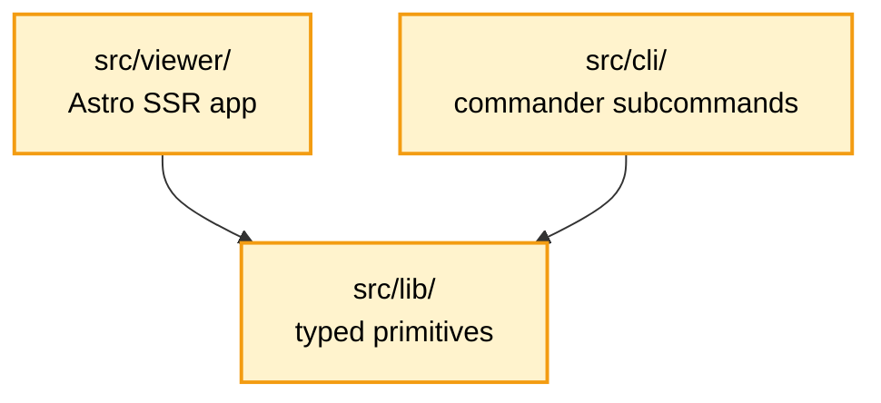

# koni-docs CLI expansion — design spec

> **Post-hoc reality (2026-05-28):** The W23 / W24-W26 phasing described
> below was compressed into one window — **all US-4.1..4.28 stories
> landed in sprint-2026-W22**, spanning v0.4.0-dev.0 → v0.7.0. See
> [sprint-2026-W22.md](../../sprints/sprint-2026-W22.md) and
> [EPIC-4.md](../../sprints/epics/EPIC-4.md) for the actual ship history
> grouped by Pillar B (lib) → C (CLI) → D (migration + polish) → E
> (viewer scaffold + preview) → F (viewer polish + validate + cleanup).
> The narrative below is preserved as the original design intent — sprint
> names should be read as "Phase B/C/D/E/F" rather than calendar weeks.

## 1. Overview

EPIC-4 expands from a single-purpose Astro docs viewer into a full
`koni-docs` CLI tool that owns every script-driven operation against
the koni-docs document model. The five hand-rolled `.mjs` scripts under
`skills/koni-docs/scripts/` are deleted outright and replaced by
subcommands of a single binary (`koni-docs`), backed by a typed,
reusable TypeScript library exported via subpath.

The viewer scope (US-4.1..4.3) originally targeted for sprint W23
shipped through v0.6.0 → v0.7.0. The CLI expansion below was originally
phased over sprints W24-W26 — in reality all of it landed in sprint-2026-W22.

## 2. Motivation

The koni-docs framework manages roughly 18 file-level entities, ~40
embedded sub-objects, and a graph of 13 cross-document ID spaces (see
[ARCHITECTURE.md — Managed object inventory](../../ARCHITECTURE.md#managed-object-inventory)).
The current automation surface is five `.mjs` scripts that share a
copy-pasted hand-rolled frontmatter parser and address table cells by
**position**, not by **column name**.

Concrete problems this design closes:

1. **BLOCKER on sprint W22** — `agile-sync-up.mjs` writes the status icon
   into the `Carry` cell of `sprint-2026-W22.md` because Status is no
   longer in the second-to-last position. Silent corruption, no warning.
2. **Hand-rolled YAML parser** — does not handle YAML lists, comments,
   quote escapes, or numeric coercion. Will fail on real story files
   from `Koni-Finance-Final` and `senti_quant`.
3. **No schema validation** — frontmatter typos (`statu:` instead of
   `status:`) ship silently; broken cross-references between layers are
   never surfaced.
4. **Drift between source and installed copies** — `skills/koni-docs/`
   (catalog source) and `.agents/skills/koni-docs/` (installed via
   `npx skills`) have diverged in 8+ files.
5. **Awkward DX** — `node skills/koni-docs/scripts/<name>.mjs
   --docs-path docs/` is verbose; consumer projects wrap it in
   `npm run agile:*` scripts that fragment over time.

A single CLI plus typed lib closes all five.

## 3. Goals and non-goals

### Goals

- **G1**: Replace all five `.mjs` scripts with subcommands of a single
  `koni-docs` binary; delete the `.mjs` files in v0.2.0.
- **G2**: Provide a typed, tree-shakeable lib exposing L1/L2/L3
  primitives (per the ARCHITECTURE.md object inventory) so other
  Koniverse products can reuse them without depending on Astro or the
  CLI framework.
- **G3**: Fix the W22 Carry-column BLOCKER by addressing table cells
  by column name, not position.
- **G4**: Lay foundation for future tier C (read commands) and tier D
  (write CRUD commands) without expanding the v0.2.0 user-facing
  surface.

### Non-goals (v0.2.0)

- **NG1**: Tier C/D user-facing commands (`list`/`get`/`show`/`validate`
  for entities; `us add ac`, `prd add fr`, etc.). Lib will support them
  but no CLI subcommand ships in v0.2.0.
- **NG2**: Removing the `koni-docs` agent skill — SKILL.md, templates,
  rules, activation surface all remain. Only `scripts/` is replaced.
- **NG3**: Migrating to Astro Content Collections as source of truth.
  The mid-term option (eliminate cross-reference tables in markdown,
  render live in viewer) is deferred to a later epic.
- **NG4**: Backward-compatibility shims for the deleted `.mjs` paths.
  v0.2.0 is a breaking change for consumer repos that hardcode
  `node skills/koni-docs/scripts/...` invocations. Migration table in
  CHANGELOG covers the transition.

## 4. Architecture

### Package layout

```
packages/koni-docs/
├── package.json
│   ├── bin: { "koni-docs": "./dist/cli/index.mjs",
│   │          "koni-docs-viewer": "./dist/cli/index.mjs" }   # alias for v0.1.0 users
│   └── exports:
│       ├── "."                  → CLI entry
│       ├── "./lib"              → full lib surface
│       ├── "./lib/markdown"     → markdown primitives only
│       ├── "./lib/schemas"      → Zod schemas only
│       └── "./viewer"           → Astro app (if needed externally)
├── src/
│   ├── lib/                     # zero dep on cli/ or viewer/
│   │   ├── corpus.ts
│   │   ├── doc.ts
│   │   ├── markdown/
│   │   │   ├── sections.ts
│   │   │   ├── tables.ts
│   │   │   └── checkboxes.ts
│   │   ├── schemas/
│   │   │   ├── story.ts
│   │   │   ├── epic.ts
│   │   │   ├── sprint.ts
│   │   │   ├── changelog-entry.ts
│   │   │   └── index.ts
│   │   ├── refs.ts
│   │   ├── changelog.ts
│   │   └── git.ts
│   ├── cli/                     # depends on lib
│   │   ├── index.ts             # commander wiring
│   │   ├── preview.ts
│   │   ├── status.ts
│   │   ├── sync.ts
│   │   ├── inject-tasks.ts
│   │   ├── backfill-fields.ts
│   │   └── backfill-commits.ts
│   └── viewer/                  # from US-4.1..4.3
│       └── (Astro project)
├── __tests__/
│   ├── lib/                     # unit tests per module
│   ├── cli/                     # spawn-based integration tests
│   └── sync-test.ts             # rewrite of scripts/__tests__/sync-test.mjs
├── tsconfig.json
└── tsup.config.ts
```

### Three-tier internal structure

The package has three independent layers with strict one-way dependency:



- **`lib/`** has zero dependency on `cli/` or `viewer/`. It is the only
  layer published for external consumers via `@koniverse/koni-docs/lib`.
- **`cli/`** imports `lib/` and orchestrates subcommands. Thin
  per-subcommand files (~50-150 lines each).
- **`viewer/`** is the Astro app from US-4.1..4.3. It imports `lib/`
  for typed access to the doc corpus during SSR.

## 5. Lib API surface

The lib exposes nine modules. Every primitive maps to operations
required by the L1/L2/L3 object inventory. Signatures below are
illustrative — final shape may vary; spec asserts behavior, not exact
TypeScript syntax.

### 5.1 `lib/corpus.ts` — multi-file operations

Operates on the entire `docs/` tree.

```ts
loadCorpus(docsPath: string, opts?: { strict?: boolean }): Corpus
readFolderMatter(dir: string, opts?: { recursive?: boolean }): MatterEntry[]
getStories(corpus: Corpus): Story[]
getEpics(corpus: Corpus): Epic[]
getSprints(corpus: Corpus): Sprint[]
getActiveSprint(corpus: Corpus): Sprint | null
resolveById(corpus: Corpus, id: string): DocEntity | null
```

`resolveById` knows ID prefixes: `US-`, `EPIC-`, `sprint-`, `FR-`,
`NFR-`, `AD-`, `D<N>`, `§N`.

### 5.2 `lib/doc.ts` — single-file I/O

```ts
readDoc(path: string): Doc       // { frontmatter, body, ast, raw, path }
writeDoc(path: string, doc: Doc, opts?: { preserveFormatting?: boolean }): void
parseDoc(raw: string): Doc       // pure
serializeDoc(doc: Doc): string   // pure
updateFrontmatter(doc: Doc, partial: Record<string, unknown>): Doc
```

Frontmatter handled by `gray-matter`. AST handled by `unified` +
`remark-parse` + `remark-stringify`. `preserveFormatting` round-trip
guarantees: if no AST changes are made, `serializeDoc(parseDoc(x))`
returns `x` byte-for-byte (excluding trailing newline normalization).

### 5.3 `lib/markdown/sections.ts`

Sections identified by heading text + level.

```ts
findSection(doc: Doc, heading: string, level?: number): SectionNode | null
getSectionText(doc: Doc, heading: string): string
replaceSection(doc: Doc, heading: string, newContent: string | Node): Doc
appendToSection(doc: Doc, heading: string, content: string | Node): Doc
removeSection(doc: Doc, heading: string): Doc
replaceSectionWithTable(doc: Doc, heading: string, table: Table): Doc
```

`replaceSectionWithTable` is the named primitive — used by `status`
subcommand to regenerate STATUS.md sections.

### 5.4 `lib/markdown/tables.ts` — column-by-name addressing

This module is where the W22 Carry bug is fixed. **All cell addressing
uses column names, not positions.**

```ts
findTable(doc: Doc, opts: { inSection?: string; afterHeading?: string }): TableNode | null
parseTable(node: TableNode): Table   // { headers: string[]; rows: Cell[][] }
findRow(table: Table, matcher: { column: string; value: string | RegExp }): number
updateCell(doc: Doc, opts: {
  tableLocator: TableLocator
  rowMatcher: RowMatcher
  column: string        // by NAME — throws if column not in headers
  value: string
}): Doc
appendRow(doc: Doc, opts: { tableLocator: TableLocator; row: Record<string, string> }): Doc
removeRow(doc: Doc, opts: { tableLocator: TableLocator; rowMatcher: RowMatcher }): Doc
updateSectionTable(doc: Doc, heading: string, updates: TableUpdate[]): Doc
```

`updateSectionTable` is the named primitive for batch row updates inside
one section.

### 5.5 `lib/markdown/checkboxes.ts`

Used by `inject-tasks` subcommand. Parses checkbox lists where each
item has an embedded ID (`AC-N`, `TASK-X.Y.N`).

```ts
parseCheckboxes(doc: Doc, heading: string): CheckboxItem[]
// CheckboxItem = { id: string; text: string; done: boolean; raw: string }

setCheckboxState(doc: Doc, opts: { heading: string; id: string; done: boolean }): Doc
appendCheckbox(doc: Doc, opts: { heading: string; id: string; text: string }): Doc
replaceCheckboxes(doc: Doc, heading: string, items: CheckboxItem[]): Doc
```

ID extraction regex per template: `^- \[[ x]\] \*?\*?(AC|TASK)-[\d.]+\*?\*? — (.+)`.
Items without an ID are returned with `id: null` and skipped by ID-based ops.

### 5.6 `lib/schemas/*.ts` — Zod schemas

```ts
// schemas/story.ts
export const storySchema = z.object({
  id: z.string().regex(/^US-\d+\.\d+$/),
  title: z.string(),
  epic: z.string().regex(/^EPIC-\d+$/),
  status: z.enum(['backlog', 'ready', 'in-progress', 'review', 'done', 'blocked', 'deprecated']),
  priority: z.enum(['P0', 'P1', 'P2', 'P3']).optional(),
  points: z.union([z.literal(''), z.literal(1), z.literal(2), z.literal(3),
                   z.literal(5), z.literal(8), z.literal(13)]).optional(),
  sprint: z.string().regex(/^sprint-\d{4}-W\d{2}$/).or(z.literal('')).optional(),
  version_shipped: z.string().regex(/^v?\d+\.\d+\.\d+$/).or(z.literal('')).optional(),
  prd_ref: z.union([z.string(), z.array(z.string())]).optional(),
  assignee: z.string().optional(),
  commit: z.string().optional(),
  created: z.string().regex(/^\d{4}-\d{2}-\d{2}$/).optional(),
  updated: z.string().regex(/^\d{4}-\d{2}-\d{2}$/).optional(),
});
export type Story = z.infer<typeof storySchema>;
```

Equivalent schemas for `epic`, `sprint`, `okr`, `design-spec`,
`changelog-entry`. Each exports both schema and inferred TS type.

```ts
validateStory(data: unknown): { ok: true; data: Story } | { ok: false; errors: ZodError }
```

`agile-backfill-fields.mjs` semantics: take a `Partial<Story>`, merge
in defaults from a constant `STORY_DEFAULTS` (no validation step on
missing required fields — validation is a separate op).

### 5.7 `lib/refs.ts` — L3 ID graph

```ts
validateRefs(corpus: Corpus): RefValidationResult[]
// each result: { source: string; ref: string; kind: RefKind; error: 'not_found' | 'wrong_type' | 'orphan' }

listChildrenOf(corpus: Corpus, parentId: string): DocEntity[]
listReferrersTo(corpus: Corpus, id: string): DocEntity[]
```

Currently surfaces broken references. Not yet exposed via CLI in
v0.2.0 (would be a tier C `validate` subcommand). Lib API is stable
from v0.2.0 onward.

### 5.8 `lib/changelog.ts`

```ts
parseChangelog(raw: string): ChangelogEntry[]
// ChangelogEntry = { version: string; date: string; title: string; commitSha: string | null;
//                    body: string; headerLine: number; commitLine: number | null }

formatVersionHeader(opts: { version: string; date: string; title: string }): string
findEntryByVersion(entries: ChangelogEntry[], version: string): ChangelogEntry | null
updateCommitSha(entries: ChangelogEntry[], version: string, sha: string): ChangelogEntry[]
serializeChangelog(entries: ChangelogEntry[]): string
```

### 5.9 `lib/git.ts`

Thin wrappers over `execFileSync('git', ...)`. No `child_process.exec`
(no shell injection surface). All functions return `null` on git error
rather than throwing.

```ts
isGitRepo(): boolean
findCommitForVersion(version: string): string | null   // 7-char SHA or null
findCommitByTag(tag: string): string | null
listVersionBumps(versionFilePath: string, limit?: number): VersionBump[]
```

## 6. CLI surface (v0.2.0)

```bash
koni-docs <subcommand> [options]
```

### Global options

| Flag | Default | Description |
|---|---|---|
| `--docs-path <path>` | `docs/` | Docs root override |
| `--dry-run` | false | Preview changes without writing files |
| `--json` | false | Machine-readable output to stdout |
| `--verbose` | false | Extra logging |
| `--help`, `-h` | — | Per-subcommand help |
| `--version`, `-V` | — | Print binary version |

### Subcommands

#### `koni-docs preview [path]`

Launch the Astro SSR viewer. Wraps the existing v0.1.0 viewer.

| Flag | Default | Description |
|---|---|---|
| `--port <n>` | 4321 | HTTP port |
| `--host <h>` | localhost | Bind host |
| `--open` | false | Open browser on start |
| `--watch` | true | Chokidar + SSE live reload |
| `--config <path>` | auto | `koni-docs.config.{json,mjs}` override |

Exit codes: 0 on graceful shutdown; 1 on bind error.

#### `koni-docs status`

Regenerate `sprints/STATUS.md` from story frontmatter.

Behavior: replaces `generate-status.mjs`. Fixes the lexicographic sort
bug (`US-1.10` vs `US-1.2`) using semver-style ID comparison.

Exit codes: 0 on success; 1 if no stories found.

#### `koni-docs sync [--story US-X.Y]`

Propagate story status through 5 layers (epic Stories table, PRD §11,
PRD §8 FR row, sprint scope table). With `--story` syncs one; without,
syncs all.

Behavior: replaces `agile-sync-up.mjs`. Column-by-name addressing
fixes W22 Carry bug.

Exit codes: 0 on success; 1 on validation failure (e.g., story.epic
points at a nonexistent EPIC file); 2 on partial success (some layers
synced, some rows not found).

#### `koni-docs inject-tasks (--story US-X.Y | --all)`

Regenerate `## Tasks` from `## Acceptance criteria`.

Behavior: replaces `agile-inject-tasks.mjs`. Improvements: AC ID is
preserved (not just text) — completed-task restoration matches by
`AC-N` ID, surviving wording edits.

Exit codes: 0 on success; 1 if no AC found.

#### `koni-docs backfill-fields`

Add missing standard frontmatter fields to all stories. Default values
defined in `lib/schemas/story.ts` (`STORY_DEFAULTS`).

Behavior: replaces `agile-backfill-fields.mjs`. Improvements:
consistent YAML output formatting (no mixed `priority: P2` vs
`points: ""`); validation error on required-field-still-empty exits
non-zero (was advisory-only).

Exit codes: 0 on success and all required fields present; 1 if any
required field still empty after backfill.

#### `koni-docs backfill-commits`

Replace `pending` Commit SHAs in `CHANGELOG.md` with real SHAs from
git history.

Behavior: replaces `changelog-backfill-commits.mjs`. Improvements: the
`[X.Y.Z]` version header is sufficient (no longer requires trailing
`— vX.Y.Z`); git ops are sandboxed in `lib/git.ts` with no shell.

Exit codes: 0 on success; 1 if no pending entries found.

## 7. Data flow examples

### Example: `koni-docs sync --story US-4.4`

```
1. corpus = loadCorpus('docs/')
2. story = resolveById(corpus, 'US-4.4')  // throws if not found
3. validate(story.data) via storySchema   // exit 1 on failure
4. for each target in [EPIC-4, PRD-§11, PRD-§8-FR, sprint-2026-W22]:
   4a. doc = readDoc(target.path)
   4b. tables.updateCell(doc, {
         tableLocator: { inSection: target.section },
         rowMatcher: { column: target.idColumn, value: story.id },
         column: 'Status',                          // by NAME, not position
         value: statusIcon(story.status)
       })
   4c. if status === 'done':
         tables.updateCell(doc, { ..., column: 'Version', value: `v${story.version_shipped}` })
   4d. writeDoc(target.path, doc)
5. emit JSON summary or human-readable log
```

`column: 'Status'` resolves via the table's header row at parse time —
if `Status` column is absent (table shape changed), throws with a
clear error pointing at the file and section.

### Example: `koni-docs status`

```
1. corpus = loadCorpus('docs/')
2. stories = getStories(corpus).filter(s => s.data.id)
3. group stories by status; sort each bucket by (epic, semver-id)
4. statusDoc = parseDoc('') with frontmatter undefined
5. for each status bucket:
   5a. tableMarkdown = renderKanbanTable(bucket)
   5b. sections.appendToSection(statusDoc, statusHeading, tableMarkdown)
6. writeDoc('docs/sprints/STATUS.md', statusDoc)
```

## 8. Migration path

### For consumer repos

The five `.mjs` paths are gone in v0.2.0. Consumers update:

| Old | New |
|---|---|
| `node skills/koni-docs/scripts/generate-status.mjs --docs-path docs/` | `npx koni-docs status --docs-path docs/` |
| `node skills/koni-docs/scripts/agile-sync-up.mjs --docs-path docs/ --story US-X.Y` | `npx koni-docs sync --docs-path docs/ --story US-X.Y` |
| `node skills/koni-docs/scripts/agile-inject-tasks.mjs --docs-path docs/ --all` | `npx koni-docs inject-tasks --docs-path docs/ --all` |
| `node skills/koni-docs/scripts/agile-backfill-fields.mjs --docs-path docs/` | `npx koni-docs backfill-fields --docs-path docs/` |
| `node skills/koni-docs/scripts/changelog-backfill-commits.mjs --docs-path docs/` | `npx koni-docs backfill-commits --docs-path docs/` |

`npm run agile:status` in `package.json` changes value from
`node skills/koni-docs/scripts/generate-status.mjs --docs-path docs/`
to `koni-docs status --docs-path docs/`.

### For the skill (`skills/koni-docs/`)

- Delete `skills/koni-docs/scripts/agile-backfill-fields.mjs`
- Delete `skills/koni-docs/scripts/agile-inject-tasks.mjs`
- Delete `skills/koni-docs/scripts/agile-sync-up.mjs`
- Delete `skills/koni-docs/scripts/changelog-backfill-commits.mjs`
- Delete `skills/koni-docs/scripts/generate-status.mjs`
- Delete `skills/koni-docs/scripts/__tests__/sync-test.mjs`
- The `scripts/` directory becomes empty and is removed.
- Update `SKILL.md` §7 — bundled scripts section becomes a thin pointer
  to `@koniverse/koni-docs` CLI; activation table updates each
  invocation entry.
- Update `references/sprint-system.md` — script references replaced
  with CLI subcommand examples.

### Same-repo dogfood

This repo (`Koni-Skills`) currently dogfoods its own koni-docs via
`docs/`. The migration story (US-4.16) updates:
- `AGENTS.md` and `CLAUDE.md` references
- `package.json` if any `agile:*` scripts exist
- `docs/sprints/README.md` if it cites script paths

### CHANGELOG v0.2.0 breaking change note

Required template entry in the v0.2.0 CHANGELOG:

> **BREAKING**: All five `.mjs` automation scripts under
> `skills/koni-docs/scripts/` have been removed and replaced by
> `@koniverse/koni-docs` CLI subcommands. See migration table below.
> Consumer repos with pinned `node skills/...` invocations in
> `package.json` scripts or CI must update before installing.

## 9. Story breakdown — EPIC-4 expansion

Three new pillars added to EPIC-4 (B / C / D). Existing US-4.1..4.3 (originally
planned for the viewer slice) shipped through v0.6.0 → v0.7.0 in sprint W22.

| Pillar | Story | Pts | Goal |
|---|---|---|---|
| B — Lib foundation | US-4.5 | 5 | `lib/corpus.ts` + `lib/doc.ts` — gray-matter + remark integration, round-trip safety |
|  | US-4.6 | 5 | `lib/markdown/sections.ts` + `lib/markdown/tables.ts` (column-by-name) |
|  | US-4.7 | 3 | `lib/markdown/checkboxes.ts` + Zod schemas (story/epic/sprint/changelog-entry) |
|  | US-4.8 | 3 | `lib/refs.ts` — L3 ID-graph validator |
|  | US-4.9 | 3 | `lib/changelog.ts` + `lib/git.ts` |
| C — CLI subcommands | US-4.10 | 3 | CLI framework (commander) + `koni-docs preview` (wires US-4.1..4.3 viewer) |
|  | US-4.11 | 3 | `koni-docs status` — delete `generate-status.mjs` |
|  | US-4.12 | 5 | `koni-docs sync` + fix W22 Carry bug — delete `agile-sync-up.mjs` |
|  | US-4.13 | 3 | `koni-docs inject-tasks` — delete `agile-inject-tasks.mjs` |
|  | US-4.14 | 2 | `koni-docs backfill-fields` — delete `agile-backfill-fields.mjs` |
|  | US-4.15 | 3 | `koni-docs backfill-commits` — delete `changelog-backfill-commits.mjs` |
| D — Migration & dogfood | US-4.16 | 3 | SKILL.md §7 update, sprint-system.md update, sync-test rewrite (TS, lib-based), this-repo dogfood update |
|  | US-4.17 | 2 | Publish `@koniverse/koni-docs@0.2.0`, CHANGELOG breaking-change note, migration table |

**Total**: 13 stories, ~43 points.

### Sprint allocation

| Sprint | Stories | Points | Goal |
|---|---|---|---|
| W24 | US-4.5, 4.6, 4.7 | 13 | Lib core (corpus + doc + markdown primitives + schemas) |
| W25 | US-4.8, 4.9, 4.10, 4.11, 4.12 | 17 | Lib finish (refs + changelog + git) + first 3 CLI subcommands incl. W22 fix |
| W26 | US-4.13, 4.14, 4.15, 4.16, 4.17 | 13 | Remaining 3 CLI subcommands + migration + publish |

W25 is borderline (17 pts) — if velocity slips, US-4.12 (sync) carries
to W26 since the W22 fix is no longer urgent by W25 (W23 is closed).

## 10. Tech stack

| Concern | Choice | Notes |
|---|---|---|
| Language | TypeScript | ESM, strict mode |
| Bundler | tsup | Zero-config; produces ESM + .d.ts; multi-entry for subpath exports |
| CLI framework | commander | Wide ecosystem, clean subcommand nesting |
| Frontmatter | gray-matter | Industry standard; handles lists/comments/escapes |
| Markdown AST | unified + remark-parse + remark-stringify | Standard, deterministic, matches Astro internals |
| AST utils | unist-util-visit, mdast-util-find-and-replace | Tree traversal + targeted edits |
| Schema | zod | Type-safe, good error messages, future-proof for Astro Content Collections |
| Watcher | chokidar | From US-4.3 |
| Test runner | node --test (built-in Node 20+) | Zero extra dep; assertions via `node:assert/strict` |

Target Node version: ≥ 20.0.0 (matches existing `engines` of catalog).

## 11. Error handling

| Error class | Source | CLI behavior |
|---|---|---|
| Missing file | `readDoc` / `loadCorpus` | exit 1, human-readable message naming the missing path |
| Frontmatter parse error | `gray-matter` | exit 1, naming file + line/column |
| Schema validation failure | `validateStory` et al. | exit 1; `--json` outputs `ZodError.format()` |
| Column not in table | `tables.updateCell` | exit 1, naming file + section + expected column + actual headers |
| Row not found | `tables.updateCell` | exit 2 (partial success — some layers synced, others not found); logs which row matcher failed |
| Git not available | `lib/git.ts` | exit 1, suggesting `git init` or rerun outside git context |
| Network error (preview) | Astro | exit 1, port-in-use message with `--port` suggestion |

All errors include a "next step" hint when actionable.

## 12. Testing strategy

### Unit tests — per `lib/` module

Each lib module has a paired `__tests__/lib/<module>.test.ts` using
`node --test` and `node:assert/strict`. Coverage targets:

- `corpus.ts` — load empty / load real / unknown ID resolves to null
- `doc.ts` — round-trip identity for unchanged docs; frontmatter
  update preserves body
- `markdown/sections.ts` — find by exact heading, missing heading,
  duplicate heading (returns first)
- `markdown/tables.ts` — column-by-name addressing; 4-col, 5-col,
  6-col, 8-col tables all work; column-missing throws
- `markdown/checkboxes.ts` — AC ID extraction; ID-based state set
  survives wording changes
- `schemas/*` — valid frontmatter passes; invalid produces typed errors
- `refs.ts` — synthetic corpus with intentional broken refs catches
  all categories
- `changelog.ts` — header parse, commit-line detection, version lookup
- `git.ts` — mocked exec; returns null on non-zero exit

### Integration tests — CLI via spawn

`__tests__/cli/*.test.ts` spawn the built CLI against a temp fixture
(same pattern as current `sync-test.mjs` but lib-based). Covers:

- Every subcommand against the existing 6-test fixture from
  `sync-test.mjs` (4-col EPIC, 5-col EPIC, 7-col sprint, 8-col sprint
  with Carry, PRD with both `### US-X.Y` and `## §11` formats)
- New regression: 8-col sprint Status correctly updated (W22 bug fix)
- `--dry-run` produces no file changes
- `--json` output is parseable JSON
- Exit codes match spec

### Sync-test migration

`scripts/__tests__/sync-test.mjs` is rewritten as
`__tests__/sync-test.ts` using the same self-contained tmpdir
pattern. Assertions stay identical at the file-content level; the
test runner upgrades from custom asserts to `node:test`. US-4.16
covers this migration.

## 13. Open questions / future scope (post-v0.2.0)

- **Tier C user-facing commands** (`list`/`get`/`show`/`validate`)
  — lib is ready; CLI work is ~1 sprint when prioritized.
- **Tier D CRUD commands** (`us add ac`, `prd add fr`, etc.) — lib
  primitives sufficient; the design of the resource-verb-subresource
  command grammar warrants its own spec.
- **Astro Content Collections integration** — once the viewer matures,
  consider rendering EPIC Stories tables, PRD §11, sprint scope as
  live views from the collection instead of hand-maintained markdown.
  Would shrink `sync` dramatically. Separate epic.
- **Pre-commit hook auto-materialization** — for the
  Astro-Collections future, hook on commit to re-render the
  hand-maintained tables, keeping GitHub-flavor markdown readable
  while collection is canonical.
- **`koni-docs init` scaffolding subcommand** — bootstrap a new
  consumer repo's `docs/` directory from templates. Currently this is
  the agent's job via SKILL.md activation table. Could move to CLI.

## 14. Cross-references

- [ARCHITECTURE.md — Koni-docs framework model](../../ARCHITECTURE.md#koni-docs-framework-model)
- [ARCHITECTURE.md — Managed object inventory](../../ARCHITECTURE.md#managed-object-inventory)
- [ARCHITECTURE.md — Open architecture questions](../../ARCHITECTURE.md#open-architecture-questions)
- [EPIC-4](../../sprints/epics/EPIC-4.md) — current viewer epic (v0.1.0); will be extended with US-4.5..4.17 for v0.2.0
- [US-4.1..4.4](../../sprints/stories/) — viewer slice stories (W23, unchanged)
- [Predecessor: koni-docs-viewer design](2026-05-27-koni-docs-viewer-design.md) — v0.1.0 scope, superseded in spirit
- [Predecessor: koni-docs-viewer implementation plan](../plans/2026-05-27-koni-docs-viewer-implementation.md) — v0.1.0 plan, still valid for W23
